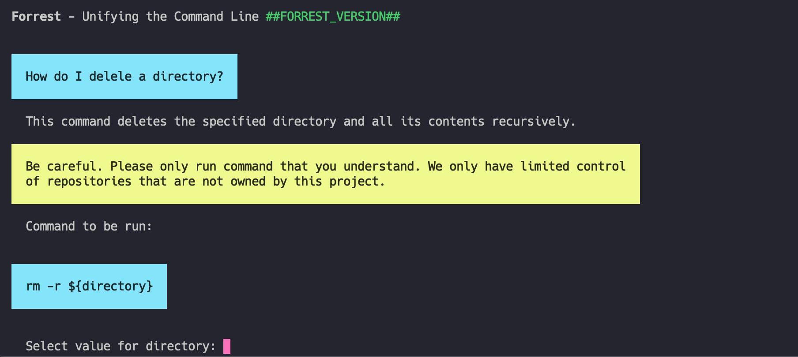
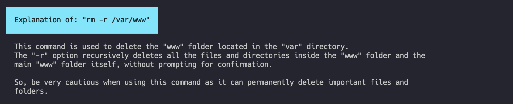

# Artificial Intelligence on the CLI

The Forrest command database is one of the biggest on the market and includes the top commands of "every" important tool on the command line out there. Nevertheless, there are command we do not know or where it is hard describe what they do so the search can't find them. In this case we now use AI to find that command.

## `how`

One day we had the idea that it would be great of you are able to ask the AI directory from the command line. Just like asking a questions. And guess what? We just did it. You can create an alias for the AI commands by running the init command:

```shell
forrest run forrest:init
```

Now you can use the `how` command like this:

```shell
how to delete a file

how to find a file named wp-config.php

how can I add a new authotized key

how to install Apache2
```


## `ai:ask`

This command will take your question as an argument and will answer it providing a short description and an runnable command. Forrest will enrich the question with all needed information like the operating system the question was asked on. 

### Example

```shell
forrest ai:ask "How do I delete a directory?"
```

At first the Forrest SaaS will try to find a command in our database that matches your question. If no answer is found we asked our AI system to answer. But we do we not always ask the AI? Commands in our database are maintained. We know what they do and we are sure the are used correct. When it comes to AI answers you never can be 100 % sure. That is why me also maintain a list of dangerous commands. If one of those commands are part of the answer we send an extra warning before running it.

The reuslt of the example is this answer:



## `ai:explain`

The explain command is our second AI-powered command. It is used to explain the user commands that they found, and they want to have more information about them.

### Example

```shell
forrest ai:explain "rm -r /var/www"
```

This command ask out AI to explain what the command will do. The answer will be:


