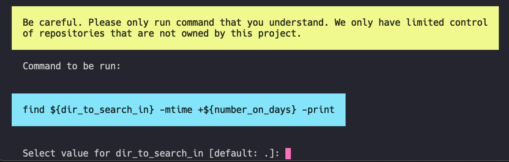

# `commands:run`

This command runs the actual scripts. 



## Parameters

Commands in Forrest can have placeholders in it. Those are used to be more flexible when creating and using them. Parameters are escaped like this `php -S localhost:${port}`. If you want to learn more about parameters please have a look at our [`Yaml format`](../formats/yaml-format.md). 

When running a command again we will suggest the recent parameter. This way it is easier to use the tool repeatedly. 

## Options

- `--force`: If this parameter is added Forrest will not ask for confirmation before running the command. As this can be very insecure (some commands come directly from the cloud) the force option can only be applied if the command did not change since the last run. 


- `--parameters`, `-p`: Commands can come with placeholders in scripts. If so the user is asked before running them for the actual values. This comes in handy when manually using the tool. When it is used y the system e.g. `crontab` the approach will fail. This is why it is possible to prefill the parameters via the CLI already. The given value must be `json` encoded. Example: `-p '{"dir_to_search_in":".", "number_on_days":"12"}'`.

## Examples

This command will run a find request and ask the user for the directory to search in and the age of the files. Afterwards it will ask for permission to run.

```shell
forrest run forrest-linux:files:find:older
```

This command will skip the question for permission and will run the command immediately.

```shell
forrest run forrest-linux:files:find:older --force
```

This command will prefill the parameters/placeholders and will just ask for permission to run.

```shell
forrest run forrest-linux:files:find:older -p '{"dir_to_search_in":".", "number_on_days":"12"}'
```

This command will prefill the parameters/placeholders and will run immediately.

```shell
forrest run forrest-linux:files:find:older -p '{"dir_to_search_in":".", "number_on_days":"12"}' --force
```
