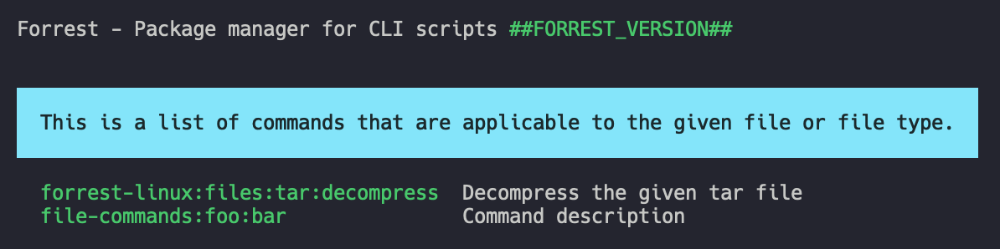

# `search:file`

This command helps finding suiting commands for a given file. 



## Example

A great example is unpacking a tar file. The command is not very complex but a lot of people will always google the parameters. In this case this command comes very handy.

```shell
forrest search:file wordpress.tar
```
When typing in this command Forrest will search for all commands that take a `tar` file as an parameter and list them. 

Then it will suggest those commands. In this case it would be `forrest-linux:files:tar:decompress` command that decompresses the file.
