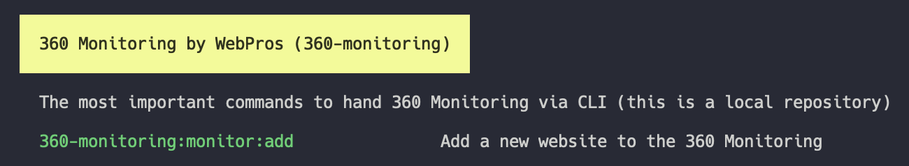

# Creating a custom Repository

Commands are divided into repositories in Forrest. We recommend that these are structured thematically and thus also grouped. This facilitates later administration and use.

When creating local repositories we recommend to choose our [YAML format](formats/yaml-format.md).

If you want to see examples of YAML file please visit the [official Forrest GitHub Repository](https://github.com/startwind/forrest-directory/tree/main/repositories) and browse through the files.

## Local Repository

In the beginning, you should always start with a local and therefore private repository. Here, you can create and manage your own commands without affecting other users.

For the creation, Forrest provides the appropriate commands.

```shell
forrest repository:create ~/local-forrest.yml
```

Once the repository is created, you can register it. Normally you will be asked if you want to add it right after the creation. In most cases this makes sense.

Newly created repositories always come with a default command that can be customized or deleted. Their content looks similar to this:

```yaml
repository:
    name: 'local commands'
    description: 'Commands for local usage'
    identifier: local-commands
    
commands:
    my-unique-command-name:
        name: 'foo:bar'
        description: 'Command description'
        prompt: 'ls -lah'
```

For adding new commands please have a look at the [yaml format description](formats/yaml-format.md).

If you did not register the repository on creation you can use the `repository:register` command.

````shell
forrest repository:create ~/local-forrest.yml
````

## Remote Repository

If you want to share a repository with the commands it contains with colleagues and others, it makes sense to store this repository on a server that is accessible to everyone.

The easiest way, and the one we recommend, is to do this via GitHub. In principle, it is sufficient to upload the locally created repository here. Instead of a local file, you then specify the `raw url`.

This looks similar to this:
`https://raw.githubusercontent.com/startwind/forrest-directory/main/repositories/friends-of-linux.yml`

In this case the command line to register that repository is:

```shell
forrest repository:create https://raw.githubusercontent.com/startwind/forrest-directory/main/repositories/friends-of-linux.yml
```

Afterwards everybody who know the URL can use the commands. 

## Private Remote Repository (GitHub)

Most of the commands we use on a daily basis are not private, but in most jobs there are some that are. This is why we introduced the private repositories that are stored in the users GitHub account. Creating those repos it pretty straight forward. Just create a `private` GitHub repository and put a [repository yaml file](formats/yaml-format.md) in there. 

Afterwards you have to add your repository to the Forrest config file which is located in your home dir. 

```yaml
# ~/.forrest/config.yml

repositories:
    gist-private:
        adapter: yaml
        name: 'private gist commands'
        description: 'Commands for local usage'
        config:
            loader:
                type: github
                config:
                    repository: forrest-directory
                    user: startwind
                    file: monitoring-repo.yml
                    token: ghp_************************************
```

## Piggyback Repository

Forrest is trying to become the standard for easy management and use of command line tools. For this reason there are the piggyback repositories.  Each open source project has the possibility to put a file named `.forrest.yml` in its root directory. As soon as Forrest is started in the same directory, the commands located there are immediately added to the list of all commands. Nothing has to be installed.



If you have an open source project your own and want the use Forrest just [create a ticket](https://github.com/startwind/forrest/issues) and we will help you with your piggyback file.

### Example

```yaml
repository:
  identifier: "360-monitoring"
  name: 360 Monitoring by WebPros
  description: The most important commands to hand 360 Monitoring via CLI
commands:
  findInFiles:
    name: "monitor:add"
    description: "Add a new website to the 360 Monitoring"
    prompt: "app"
```
