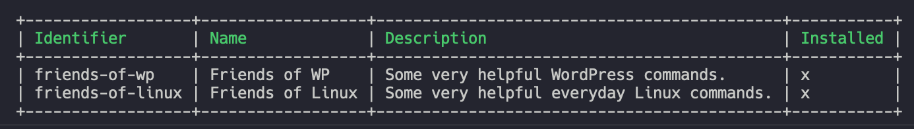

# Repository Directory

The Forrest Directory is a constantly growing collection of command repositories. Each repository can contain multiple commands.

To see the latest list of officially supported repositories, use the following command line command.

```shell
forrest directory:list
```
The output should look similar to this screenshot.



## Official Repositories

- **Friends of Linux** - Some very helpful everyday Linux commands.
- **Friends of WP** - Some very helpful WordPress commands.
- **Friends of PHP** - Some very helpful PHP CLI commands.
