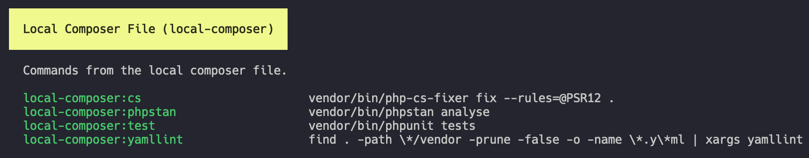

# Friends with everyone

We know that are a lot of ways to store your commands. Normally attached to a project with scripts. In modern projects they are often bound to a `composer.json`, `package.json` or `make` file. When Forrest finds such files in the current directory it will automatically add the scripts to the `commands:list` and you can just run them via Forrest.

