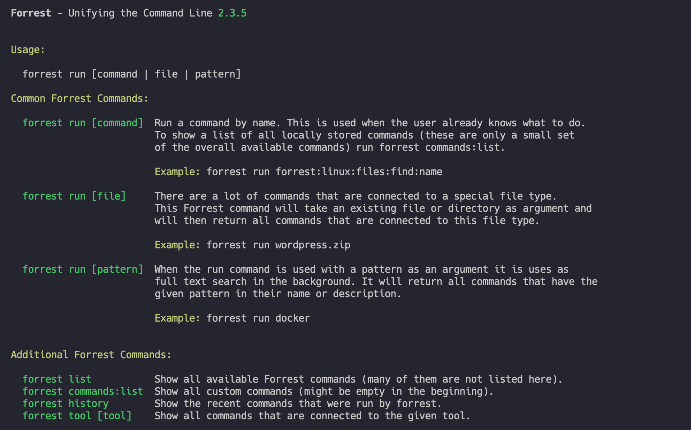

# Forrest - AI supported command line.

[](https://scrutinizer-ci.com/g/startwind/forrest/?branch=main)

Forrest is an easier way to execute and share commands on your command line. They are easily parameterized and
searchable by name, description, or command arguments.

Often there are only a handful of commands that are used in everyday life, also many command line tools have a lot of
possible options, but only a few of them are used. We have designed Forrest to store exactly these commands centrally
and thus simplify the use of the command line by a lot.



**Forrest is ...**

- ... [AI powered](docs/ai/overview.md)
- ... [awesome](docs/awesome.md)
- ... [constantly in development](docs/changelog.md)
- ... [secure by design](docs/secure-by-design.md)
- ... [easy to extend with custom commands](docs/creating-repository.md)
- ... [friends with everyone](docs/friends.md)
- ... [open source](LICENSE)

## Installation

Download the latest version of our PHAR archive and give it afterwards rights to be executed. To run Forrest you need PHP installed.  

```shell
wget https://github.com/startwind/forrest/releases/latest/download/forrest.phar
chmod +x forrest.phar
```

Most likely, you want to put the forrest.phar into a directory on your PATH, so you can simply call forrest from any
directory (global install), using for example:

```shell
sudo mv forrest.phar /usr/local/bin/forrest
```

## Usage

The default installation of Forrest comes with only a few commands. We decided to keep the basic version very clean.
Nevertheless there is the official Forrest directory where a lot of predefined commands are located. You can search for commands in three different ways:


```shell
forrest run [file] 
```

There are two main use cases. The first one is that we have a file, and we want to know what to do with it. In this case we use the run command in combination with the file we want to interact with. Afterwards Forrest will return all commands that are associated with that filename or file type. Example: `forrest run latest.zip` will return the command on how to unzip this file. 

```shell
forrest run [pattern] 
```

If the task you want to a accomplish is not directly associated to a file on your machine you can use the pattern argument. This way our SaaS search engine will try to find suiting commands. Example: `forrest run WordPress` will return all WordPress related commands. 

```shell
forrest run [command] 
```

Run a command by name. This is used when the user already knows what to do. To show a list of all commands visit [forrest.startwind.io](https://forrest.startwind.io) or run `forrest commands:list` (this list can be empty if you did not create commands on your ow yet.


```shell
forrest ask [question] 
```

Forrest is AI powered. That means, if we do not find a matching command in our database you can ask our large language model for al solution to your problem. [read more about our AI features](docs/ai/overview.md)


## How to support

Forrest is an open source project and is always looking for supporters. Anyone who has experience with PHP can help
extend the tool. But even without the experience can help. Here are several ways to support this project:

- **Add ideas and inform about bugs** - The easiest way to help this project is adding your own ideas. We know the more
  people use this tool, the more ideas will come up. So feel free to add yours in
  our [issue tracker](https://github.com/startwind/forrest/issues).


- **Pull requests** - If you are able to code, feel free to send us
  your [pull requests](https://github.com/startwind/forrest/pulls). If you have no idea for your own enhancements please
  have a look at our tracker. Easy to start tasks are marked
  as ["good first issue"](https://github.com/startwind/forrest/issues?q=is%3Aissue+is%3Aopen+label%3A"good+first+issue").
  Please also have a look at our [developer guidelines](docs/development/index.md).


- **Add repositories** - Everybody is an expert in something. That means you can add your own repositories about your
  tool. Just inform us when you are done and we will add it to
  the [official directory](https://github.com/startwind/forrest-directory).

## Why we have chosen Forrest as the name

It's an homage to one of our favorit movies "Forrest Gump" and especially the scene with "Run Forrest! Run!". And we run
as well. Command line scripts.

## How to add your custom repository

It is very easy and straight forward to create new repositories, that can be used with Forrest.

- [How to create custom repository](docs/creating-repository.md)
