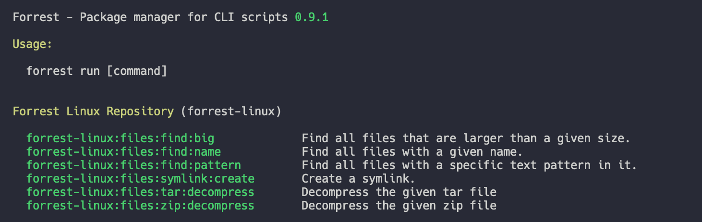

# Forrest - The package manager for command line scripts

[](https://scrutinizer-ci.com/g/startwind/forrest/?branch=main)

Forrest is an easier way to execute and share commands on your command line. They are easily parameterized and searchable by name, description, or command arguments.

Often there are only a handful of commands that are used in everyday life, also many command line tools have a lot of
possible options, but only a few of them are used. We have designed Forrest to store exactly these commands centrally
and thus simplify the use of the command line by a lot.



## Installation

Download the latest version of our PHAR archive and give it afterwards rights to be executed.

```shell
wget https://github.com/startwind/forrest/releases/latest/download/forrest.phar
chmod +x forrest.phar
```

Most likely, you want to put the forrest.phar into a directory on your PATH, so you can simply call forrest from any directory (global install), using for example:

```shell
sudo mv forrest.phar /usr/local/bin/forrest
```

## Usage

The default installation of Forrest comes with only a few commands. We decided to keep the basic version very clean.
Nevertheless there is the official Forrest directory where a lot of predefined commands are located. To list all the
repositories run

```shell
./forrest.phar directory:list
```

Choose the repositories you want to use. Behind every of those there can be many commands. To learn more about the
official repositories visit our [directory documentation](docs/directory.md).

## Commands

### Commands

- `commands:list` - List all registered commands that can be run.
- `commands:show` - Show a single command with all its details and steps that will be executed.
- `commands:run` - Run a single command.
- `commands:history` - Show the recent commands that were executed.

### Search Commands

- `search:file` - Shows a list of commands that fit the given file. [More information](docs/commands/search_file.md)

### Repository Commands

- `repository:list` - Shows a list of all registered repositories.
- `repository:create` - Creates a new repository and adds it (optional).
- `repository:register` - Add an existing repository to Forrest.

### Directory Commands

- `directory:list` - List all repositories from the Forrest directory.
- `directory:install` - Install a specified repository from the Forrest directory.
- `directory:remove` - Remove a specified installed repository.

## How to support

Forrest is an open source project and is always looking for supporters. Anyone who has experience with PHP can help
extend the tool. But even without the experience can help. Here are several ways to support this project:

- **Add ideas and inform about bugs** - The easiest way to help this project is adding your own ideas. We know the more
  people use this tool, the more ideas will come up. So feel free to add yours in
  our [issue tracker](https://github.com/startwind/forrest/issues).


- **Pull requests** - If you are able to code, feel free to send us
  your [pull requests](https://github.com/startwind/forrest/pulls). If you have no idea for your own enhancements please
  have a look at our tracker. Easy to start tasks are marked
  as ["good first issue"](https://github.com/startwind/forrest/issues?q=is%3Aissue+is%3Aopen+label%3A"good+first+issue"). Please also have a look at our [developer guidelines](docs/development/index.md)


- **Add repositories** - Everybody is an expert in something. That means you can add your own repositories about your
  tool. Just inform us when you are done and we will add it to
  the [official directory](https://github.com/startwind/forrest-directory).

## Why we have chosen Forrest as the name

It's an homage to one of our favorit movies "Forrest Gump" and especially the scene with "Run Forrest! Run!". And we run
as well. Command line scripts.

## How to add your custom repository

It is very easy and straight forward to create new repositories, that can be used with Forrest. 

- [How to create custom repository](docs/creating-repository.md)
