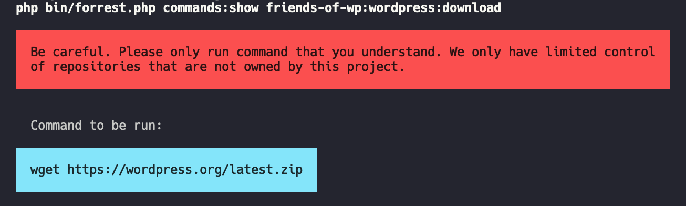

# Forrest - CLI tool to manage and run your common command line calls.

[](https://scrutinizer-ci.com/g/startwind/forrest/?branch=main)



## Installation

Download the latest version of our PHAR archive and give it afterwards rights to be executed.

```shell
wget https://github.com/startwind/forrest/releases/latest/download/forrest.phar
chmod +x forrest.phar
```

## Usage

### Repository Commands

- `repository:list` - Shows a list of all registered repositories. This is a combination of default repos and custom ones.

### Commands

- `commands:list` - List all registered commands that can be run.
- `commands:show` - Show a single command with all its details and steps that will be executed. 

## Why we have chosen Forrest as the name

It's an homage to one our favorit movies "Forrest Gump" and especially the scene with "Run Forrest! Run!". And we run as well. Command line scripts.

## How to add your custom repository
